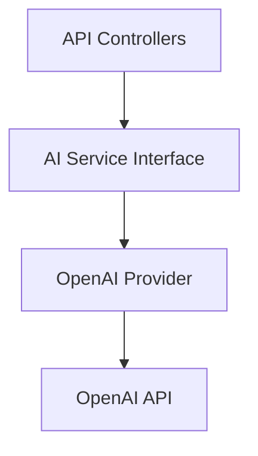

<h1 align="center">
  <br>
  📝 Paperless
  <br>
</h1>

<h4 align="center">A modern, AI-powered form builder and response intelligence platform built with the MERN stack.</h4>

<p align="center">
  <a href="#overview">Overview</a> •
  <a href="#features">Features</a> •
  <a href="#the-core-workflow">Workflow</a> •
  <a href="#engineering-decisions">Engineering</a> •
  <a href="#tech-stack">Tech Stack</a> •
  <a href="#getting-started">Getting Started</a>
</p>

---

## Overview

Paperless is a production-ready alternative to Google Forms that brings AI directly into the form creation and response analysis workflows. Built with a minimalist, high-performance React frontend and a secure Express/MongoDB backend, Paperless removes the friction from collecting and understanding data.

The platform follows a clear four-step central workflow:
**CREATE** forms with a drag-and-drop builder → **PUBLISH** them to the web → **COLLECT** structured responses and files → **UNDERSTAND** the results through automated analytics and AI-generated insights.

---

## Why Paperless?

Most form builders stop working for you the moment a user hits "Submit." You are left exporting spreadsheets and manually searching for trends.

Paperless is built on the philosophy that:
1. Forms should be frictionless to create.
2. AI should act as a consultant during creation, not a black-box replacement for the user.
3. Useful insights should be generated from collected responses automatically.
4. Humans must always remain in control of AI-generated changes (Human-in-the-Loop).

---

## Features

### 📋 Form Builder
- **Drag-and-Drop Interface:** Built with `react-beautiful-dnd` with strict-mode compatibility.
- **8 Question Types:** Short text, long text, number, email, single choice, multiple choice, dropdown, and file upload.
- **Advanced Logic:** Conditional visibility rules and required field validation.
- **Lifecycle Management:** Draft, published, and closed form states.

### 🤖 Creation Intelligence
- **AI Question Generation:** Enter a topic to receive a proposed list of relevant questions.
- **Writing Improvement:** Ask the AI to rephrase or clarify existing questions.
- **Human-in-the-Loop:** AI suggestions are presented as proposals that the user can preview, accept, or reject without mutating the actual form state behind the scenes.

### 🧠 Response Intelligence
- **Automated Summaries:** AI-generated executive summaries of collected response datasets.
- **Theme Extraction:** Automated categorization and thematic analysis of text-heavy submissions.
- **Privacy-Safe Payloads:** The backend securely constructs limited context windows to prevent token exhaustion and data leakage during AI analysis.

### 📊 Analytics & Responses
- **Real-Time Aggregation:** MongoDB aggregation pipelines calculate response statistics, charts, and timelines without loading massive datasets into memory.
- **Export:** Download raw response data as JSON or CSV.
- **Pagination:** Cursor-based pagination for reviewing individual submissions.

### 📁 Secure File Uploads
- **S3-Compatible Storage:** Files are securely uploaded to AWS S3 (or compatible object storage).
- **Protected Downloads:** Files are never public; downloads use short-lived presigned URLs.
- **Validation:** Upload limits, MIME-type verification, and disk-backed temporary staging.

### 🔒 Authentication & Security
- **Secure Sessions:** HttpOnly cookies for both access and refresh tokens to prevent XSS.
- **Token Architecture:** Stateful, hashed refresh tokens with rotation and revocation capabilities.
- **Rate Limiting:** IP-based rate limiting on authentication and AI endpoints.
- **Authorization:** Strict ownership checks on all protected resources.

---

## The Core Workflow

### 1. CREATE
Users build forms using a modern, minimalist editor. The AI Form Consultant can suggest new questions or refine existing ones. All AI interactions use a proposal workflow, ensuring the user remains in absolute control of the form structure.

### 2. PUBLISH
Once finalized, forms transition from `draft` to `published`. A public link is generated. Published forms enforce structural immutability to ensure response data integrity.

### 3. COLLECT
Respondents submit data through a clean, responsive public view. Submissions handle complex validations, multi-part form data, and secure file uploads to an S3 bucket.

### 4. UNDERSTAND
Instead of just viewing a table of answers, form owners see an analytics dashboard powered by MongoDB aggregation. For deeper insights, owners can trigger the Response Intelligence engine to summarize qualitative data and extract key themes.

---

## AI Architecture

Paperless implements AI features through a robust, abstracted service layer:



- **Provider Abstraction:** The core logic is decoupled from specific LLM vendors.
- **Structured Outputs:** The backend uses precise schemas (via Zod) to ensure the AI returns strictly formatted JSON proposals.
- **Input Limits & Guardrails:** Response Intelligence features use carefully truncated datasets to respect context windows and manage API costs.

---

## Engineering Decisions

### Service Abstractions
**Decision:** Critical external dependencies (LLMs, Storage, Email) are wrapped in dedicated service classes (`AIService.js`, `StorageService.js`, `EmailService.js`).
**Why:** This isolates third-party SDKs from business logic, allows for seamless local mocking during development without spinning up external resources, and makes future provider migrations (e.g., migrating from OpenAI to Anthropic) nearly trivial.

### Stateful Refresh Tokens
**Decision:** Paperless uses short-lived JWT access tokens alongside long-lived, stateful refresh tokens stored in the database.
**Why:** This architecture allows users to maintain multiple active sessions (e.g., mobile and desktop concurrently) while preserving the ability to forcefully revoke specific sessions upon logout or suspected compromise. It balances UX convenience with strict security.

### MongoDB Aggregation
**Decision:** Analytics are processed entirely inside the database using aggregation pipelines (`$match`, `$group`, `$unwind`).
**Why:** Loading massive datasets into Node.js memory just to compute counts and averages is unsafe. Aggregation pipelines offload this computational burden to the database engine, ensuring the API remains highly responsive even when a form receives thousands of submissions.

### Secure File Handling
**Decision:** Uploads are processed through Multer, temporarily staged to disk, validated (size, MIME type), and pushed to a private S3 bucket. Access is exclusively brokered via short-lived presigned URLs.
**Why:** This prevents malicious file execution on the server, avoids publicly exposing the storage bucket, and ensures that only authorized form owners can access submitted documents.

---

## Tech Stack

| Domain | Technologies |
|---|---|
| **Frontend** | React 18, Vite, Redux Toolkit, React Router, TailwindCSS, Recharts, React Beautiful DnD |
| **Backend** | Node.js, Express.js, JWT, bcryptjs, Helmet, Zod, Multer |
| **Database** | MongoDB, Mongoose ODM |
| **AI** | OpenAI API |
| **Storage** | AWS S3 SDK (Client-S3, Presigner) |
| **Email** | Resend |
| **Testing** | Vitest, Supertest, MongoDB Memory Server |

---

## Project Structure

```text
paperless/
├── client/                 # React Frontend
│   ├── src/
│   │   ├── components/     # Reusable UI components
│   │   ├── pages/          # Full page views
│   │   ├── store/          # Redux slices
│   │   └── utils/          # Axios configuration and API helpers
│   └── package.json
│
├── server/                 # Express Backend
│   ├── src/
│   │   ├── controllers/    # Route handlers & business logic
│   │   ├── middleware/     # Auth, error handling, file uploads
│   │   ├── models/         # Mongoose schemas
│   │   ├── routes/         # Express route definitions
│   │   └── services/       # Abstractions (AI, Storage, Email)
│   └── package.json
│
└── package.json            # Root workspace config
```

---

## Getting Started

### Prerequisites
- **Node.js** (v20+ recommended)
- **MongoDB** (Local instance or Atlas cluster)
- **OpenAI API Key** (Required for AI features)
- **AWS S3 / Compatible Object Storage** (Required for file uploads)
- **Resend API Key** (Optional, for emails)

### 1. Clone & Install
```bash
git clone https://github.com/anurag-jaiswal-aj/paperless.git
cd paperless

# Install dependencies for both client and server
npm run install:all
```

### 2. Environment Variables
Create a `.env` file in the `server` directory:

```bash
cd server
cp .env.example .env
```

Required variables (use secure, random strings for secrets):
```env
PORT=5000
NODE_ENV=development
FRONTEND_URL=http://localhost:5173

# MongoDB
MONGO_URI=mongodb://localhost:27017/paperless

# JWT Authentication
JWT_SECRET=your_super_secret_jwt_key
JWT_EXPIRE=15m
JWT_REFRESH_SECRET=your_refresh_secret_key
JWT_REFRESH_EXPIRE=7d

# OpenAI
OPENAI_API_KEY=sk-...

# Storage (S3 Compatible)
S3_REGION=us-east-1
S3_BUCKET=paperless-uploads
S3_ACCESS_KEY_ID=...
S3_SECRET_ACCESS_KEY=...
# S3_ENDPOINT=https://your-custom-endpoint.com (Optional)

# Email (Resend)
RESEND_API_KEY=re_...
EMAIL_FROM=noreply@yourdomain.com
```
*Note: If S3 or Resend credentials are omitted in development, the backend will gracefully fallback to local mocking and console logging.*

For the frontend, create a `.env` file in the `client` directory:
```env
VITE_BACKEND_URL=http://localhost:5000
```

### 3. Development
You can run the development servers concurrently from the root directory, or in separate terminal windows:

```bash
# Terminal 1: Start Backend
npm run server

# Terminal 2: Start Frontend
npm run client
```

---

## Testing

The backend includes a comprehensive Vitest suite using `mongodb-memory-server` to execute true integration tests against the database without mocking the ODM.

**Current Coverage:** 14 Test Suites, 118 Passing Tests.

```bash
# Run tests
npm run test

# Run linter
npm run lint

# Build client for production
npm run build:client
```

---

## Security

Paperless is built with modern web security practices:
- **Authentication:** Uses strictly `HttpOnly`, `Secure`, and `SameSite` cookies. Tokens are never exposed to JavaScript/localStorage.
- **Brute Force Protection:** Uses `express-rate-limit` on authentication, password reset, and AI endpoints.
- **Data Integrity:** Forms transition states securely. Question options and constraints are strictly validated via Mongoose and Zod.
- **File Security:** Uploads are constrained by size limits and MIME types. S3 objects are kept private and accessed exclusively via short-lived presigned URLs.
- **Error Masking:** Development stack traces are never leaked in the production environment.

*Security limitations:* The current implementation does not support 2FA or organization-level SSO. It has not been formally audited for enterprise compliance (e.g., SOC2, HIPAA).

---

## API Overview

The Express backend exposes a structured REST API:

- **`/api/auth`** - Register, login, logout, session refresh, and password reset.
- **`/api/forms`** - CRUD operations for forms. Enforces ownership authorization.
- **`/api/forms/:id/questions`** - Sub-resource routing for managing form questions and ordering.
- **`/api/responses`** - Public submission endpoint and protected response retrieval/analytics.
- **`/api/ai`** - Endpoints for triggering Creation Intelligence and Response Intelligence tasks.

---

## Roadmap

**✅ Implemented**
- Drag-and-drop form builder
- MongoDB aggregation analytics
- AI Form Consultant (Question suggestion & refinement)
- Secure S3 file uploads
- HttpOnly JWT authentication

**🔭 Planned Scope**
- Custom branding and themes per form
- Webhook integrations for form submissions
- Multi-user collaboration on draft forms

---

## Current Scope / Non-Goals

Paperless is an excellent solution for general data collection, surveys, and applications. However, to keep the codebase maintainable and focused, the following are explicitly **not** goals for the current project phase:
- Complex multi-page branching logic.
- HIPAA/PCI compliant storage environments.
- Custom domain mapping.
- Native mobile applications.
- Payment gateway integration (e.g., Stripe/PayPal) for form submissions.

---

## Project Status

Paperless is currently in active development. The core features, intelligence layer, and authentication mechanisms are stable and fully tested.

---

## Contributing

Contributions are welcome! Please follow this workflow:
1. Fork the repository.
2. Create a feature branch (`git checkout -b feature/amazing-feature`).
3. Ensure all tests and linters pass (`npm run test && npm run lint`).
4. Commit your changes (`git commit -m 'feat: add amazing feature'`).
5. Push to the branch (`git push origin feature/amazing-feature`).
6. Open a Pull Request.

---

## License

This project is licensed under the MIT License - see the [LICENSE](LICENSE) file for details.
